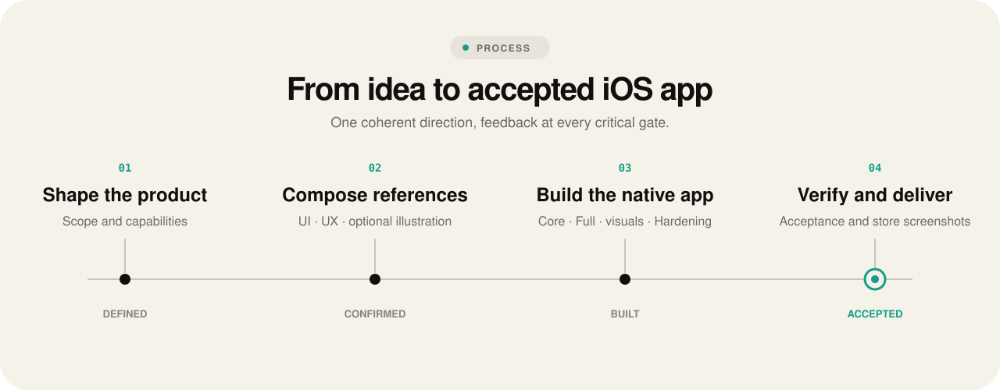
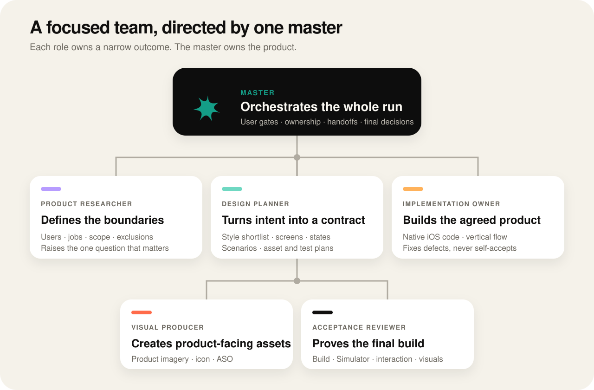

[Website](https://stepzme.github.io/trickster/) · English · [Русский](https://github.com/stepzme/trickster/blob/main/README.ru.md) · [Español](https://github.com/stepzme/trickster/blob/main/README.es.md) · [简体中文](https://github.com/stepzme/trickster/blob/main/README.zh-CN.md)

<p align="center">
  
</p>

### An AI app factory for native iOS.

Turn an app idea into a native iOS product shaped by a curated design library — scoped, designed, built, verified in Simulator, and completed with an original app icon and ASO screenshots.

Trickster orchestrates specialized AI roles inside your repository. It reads a small GitHub catalog, downloads documents for up to three relevant styles, requires you to select exactly one, saves that package in the project, and independently checks the implemented result.

## What you get

- a functional Xcode project and native iOS app;
- a product scope grounded in your brief and existing project;
- one confirmed visual language saved locally after selection from the GitHub catalog;
- custom-styled controls that preserve native iOS behavior and accessibility;
- build, Simulator, interaction, and visual verification artifacts;
- one original app icon informed by reviewed Logoinspo references;
- one ASO screenshot set made from the accepted build.

## The pipeline



1. **Define the product.** Establish the requested scope, boundaries, and any decision that genuinely needs user input.
2. **Compare relevant styles.** Read the GitHub catalog, choose up to three candidates by metadata, and download documents only for those candidates.
3. **Select one direction.** Require exactly one package before UI work. Packages cannot be merged or split across screens.
4. **Create the contract.** Define screens, states, scenarios, assets, and acceptance checks.
5. **Build the app.** Implement one vertical flow first, visually inspect it, then complete the agreed scope.
6. **Verify independently.** Build, install, run, interact with, and inspect the final app in Simulator. Missing evidence remains `UNVERIFIED`.
7. **Finish the store package.** Produce an original app icon and, after acceptance, ASO screenshots from the real build.

Trickster uses multiple focused roles when the active agent harness supports delegation and follows the same contracts sequentially when it does not.

## The agent team



The **master** owns the run end to end: it speaks with the user, enforces gates, assigns file and Simulator ownership, validates handoffs, and makes the final decision. The five role contracts keep research, design, implementation, visual production, and acceptance focused and independently reviewable. In a harness without delegation, the master executes the same contracts sequentially.

## Quick start

Run from an existing Git, Xcode, Swift Package, or XcodeGen project root:

```sh
npx @sgx22/trickster init
```

Codex is the default adapter. Check the local installation:

```sh
npx @sgx22/trickster doctor
```

Then ask your agent to create or substantially change an iOS app using Trickster. The installed project instructions activate the pipeline and enforce its design and acceptance gates.

For another agent harness:

```sh
npx @sgx22/trickster init --harness generic
```

Follow `trickster/adapters/generic.md` to map the orchestration operations to that environment.

## How it is installed

Trickster is installed into the current project, not globally:

```text
trickster/
├── AGENTS.md
├── HARNESS
├── roles/
├── adapters/
├── workflow/
├── templates/
├── design/
└── artifacts/
```

- `design/` contains the only style package confirmed for the current product.
- `artifacts/<run-id>/` contains contracts, evidence, screenshots, and review results.
- `roles/` and `workflow/` define the factory stages independently of a specific agent harness.
- `adapters/` map those stages to Codex or another environment.

Re-running `init` updates managed workflow files while preserving the selected design and run artifacts.

## Design sources

- **The GitHub style catalog** lists the available reference apps. Trickster downloads documents only for the shortlisted packages, then stores the selected `source.json`, `ui.md`, `ux.md`, and optional `illustrations.md` in `trickster/design/`.
- **Logoinspo App Icons** supplies references for the original app-icon direction.

The style package is not a skin. Native controls may provide behavior, accessibility, focus, and keyboard integration, but their visual appearance must explicitly inherit `ui.md` when the reference defines a distinct language.

## Detailed stages

| Stage | Owner | Required result |
|---|---|---|
| 1. Scope | product-researcher | Explicit scope status and missing decisions |
| 2. Style selection | design-planner + user gate | Up to three GitHub candidates and exactly one locally saved package |
| 3. Product contract | design-planner | Screens, states, scenarios, assets, and verification plan |
| 4. Product assets | visual-producer when needed | Verified imagery or a justified `N/A` |
| 5. Implementation | implementation-owner | Vertical flow followed by the complete agreed scope |
| 6. App icon | visual-producer | One original concept installed in the app |
| 7. Acceptance | acceptance-reviewer + master | Independently verified final build |
| 8. ASO screenshots | visual-producer | One set based on real screens from the accepted build |
| 9. Finalization | master + user gate | Explicit user confirmation and cleanup of temporary files |
| 10. Delivery | master | Reproducible evidence and final status |

See [the master process](workflow/master-prompt.md) and [orchestration contract](workflow/orchestration.md) for the exact execution rules.

## Core guarantees

- The style shortlist contains no more than three packages selected from catalog metadata; only their documents are downloaded.
- UI implementation stops until the user selects exactly one package.
- Packages cannot be merged; the selected package is the only design context.
- Native control behavior is preserved while appearance follows the selected visual language.
- An implementation agent cannot accept its own work.
- Build success alone is not acceptance.
- Unavailable tools or evidence are reported as `UNVERIFIED`, never invented.

## Requirements and boundaries

Trickster requires macOS, Xcode, an appropriate iOS Simulator runtime, Node.js 20 or later, and an agent environment capable of reading the installed instructions and using project tools. A new style selection requires access to the raw files in the Trickster GitHub repository; an existing project continues to use its locally saved package.

Signing, release archives, physical-device validation, App Store submission, and external production infrastructure are separate release tasks unless explicitly included in the product scope.

Global installation is intentionally rejected. Use `npx` as a temporary launcher inside the target project.

## Project documentation

- [Master process](workflow/master-prompt.md)
- [Role orchestration](workflow/orchestration.md)
- [Style selection](workflow/style-reference.md)
- [Implementation](workflow/implementation.md)
- [Acceptance](workflow/acceptance.md)
- [End-to-end verification](workflow/verification.md)

External documentation:

- [Apple: Running your app in Simulator](https://developer.apple.com/documentation/Xcode/running-your-app-on-simulated-or-physical-devices)
- [Apple: App icons](https://developer.apple.com/design/human-interface-guidelines/app-icons)
- [Apple: Screenshot specifications](https://developer.apple.com/help/app-store-connect/reference/app-information/screenshot-specifications)
